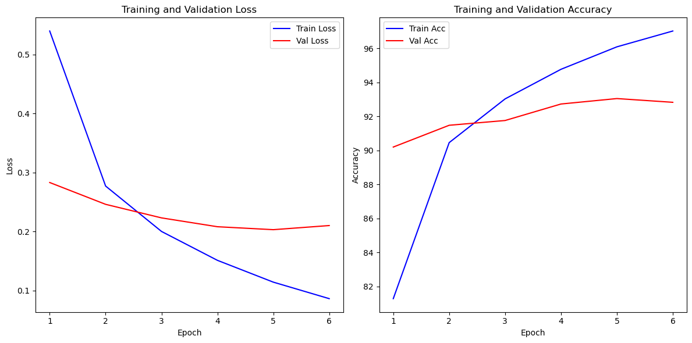
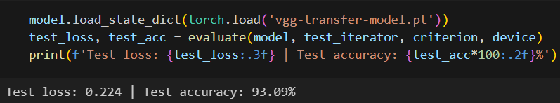

# NeoCat
# Image Classification Project Using Convolutional Neural Networks

In this project, a web service for image classification using convolutional neural networks (CNNs) has been implemented. The CIFAR-10 dataset was utilized for model training, containing 60,000 color images divided into 10 classes.

## Usage of the VGG-16 Model

The VGG-16 model is employed for image classification. This architecture comprises features and a classifier. Prior to training, images are processed using a sequence of transformations to prepare them for model training.

## Web Interface

For convenient user interaction, a web interface based on the Django framework has been created. Users can upload images and receive a response with the name of one of the 10 classes proposed in the CIFAR-10 dataset.

## Setup Instructions

1. Download the project from the repository.
2. Install all necessary dependencies using `poetry install`.
3. Run the Django server with the command `python manage.py runserver` or `docker-compose up`.
4. Follow the link displayed in the console to access the web interface.

## References

- [CIFAR-10 Dataset](https://www.kaggle.com/c/cifar-10)
- [Model file](https://drive.google.com/file/d/1Tfu8ZMTBM2OHqWjvdFUCLKliNS5rRyAl/view?usp=drive_link)

## Our team
- [Andriy Dykan](https://github.com/AndriyDykan)
- [Valeria Tovstenko](https://github.com/MsMiracle18)
- [Andriy Mykhailyuk](https://github.com/Andriy22226)
- [Vadim Bezhuk](https://github.com/Vadim-3)
- [Bogdan Kataryna](https://github.com/9-Bogdan)

Please ensure to properly set up and configure the environment before running the project.
